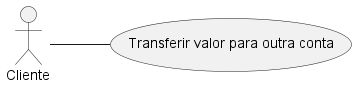

# Casos de Uso

## CDU1 - Transferir valor para outra conta

* Ator principal: Cliente

### Fluxo principal

1. O ator informa o número da conta origem.

2. O sistema verifica se a conta origem existe.

3. O ator fornece a senha para autenticação.

4. O sistema valida a senha.

5. O ator informa o número da conta destino.

6. O sistema verifica se a conta destino existe.

7. O ator informa o valor a ser transferido.

8. O sistema efetua a transferência dos valores entre as contas dentro de uma transação.

9. O sistema confirma o sucesso da operação ao ator.

### Fluxos de exceção

No passo 2, se a conta origem não existir, o sistema informa erro de conta inexistente e interrompe o fluxo.

No passo 4, se a senha informada for inválida, o sistema informa erro de autenticação e encerra o fluxo.

No passo 6, se a conta destino não existir, o sistema informa erro de conta inexistente e interrompe o fluxo.

No passo 8, se o saldo da conta origem for insuficiente, o sistema informa erro e cancela a operação.

No passo 8, se o valor ultrapassar o limite máximo permitido, o sistema informa erro de valor excedido e interrompe o fluxo.
