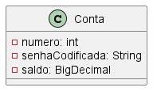

# Modelo de domínio

No sistema de transferências, a principal entidade é a Conta.

O campo senhaCodificada armazena um hash da senha que pode ser usado para verificação.

Caso fosse necessário recuperar um histórico das transferências realizadas, haveria também uma classe Transferência.