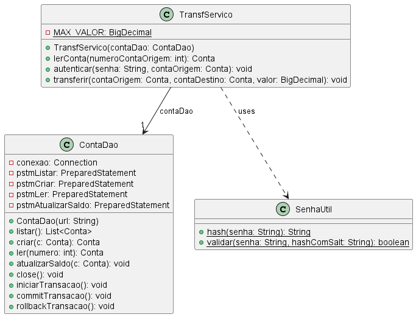

# Testes do Sistema Transferidor

Serão desenvolvidos testes unitários para TransfServico, pois contém regras de negócio, validações e transações. É o principal foco para testes unitários.

Serão desenvolvidos testes de integração envolvend ContaDao e TransfCasoUso.

TransfUI serão testadas por testes funcionais, testes de interface ou manuais.

A classe Conta, por ser praticamente uma classe contâiner (com atributos e respectivos getters e setters) sem regras de negócio e de validação, não terá testes unitários. Os demais testes serão suficientes para verificar seu funcionamento.

## Testes unitários da classe TransfServico

TransfServico contém regras de negócio, validações e transações. Ela utiliza uma instância de ContaDao e métodos estáticos de SenhaUtil.

